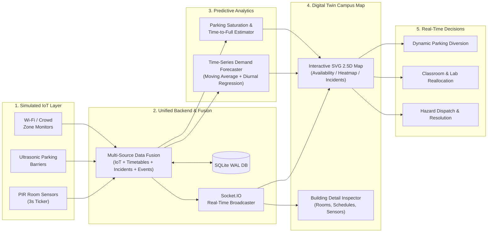

# Campus Digital Twin (Lovely Professional University — Phagwara, Punjab)

An interactive, production-grade, real-time digital replica of Lovely Professional University's ~600-acre campus in Phagwara, Punjab. Built end-to-end to model academic blocks (Block 34 CSE, Block 32 Mechanical, Block 25 Pharmacy, Block 37 Central Library, Block 13 DSW), Uni-Mall, Baldev Raj Mittal UniPolis, Shanti Devi Mittal Indoor Stadium, Boys & Girls Hostels (BH-4 & GH-2), research labs, parking lots, crowd zones, and maintenance tickets with live IoT telemetry streams and predictive decision support.

> [!NOTE]
> *Building numbers and campus landmarks reflect authentic LPU layout and numbering conventions (e.g., Block 34 for CSE, Block 37 for Central Library, UniPolis, Uni-Mall, BH/GH residential clusters) configured for high-fidelity interactive simulation and demonstration purposes.*

---

## 🏛️ System Architecture & Pipeline Mapping

The system follows a strict 5-stage real-time data and decision-support pipeline:

$$\text{IoT / Sensors} \longrightarrow \text{Backend} \longrightarrow \text{Analytics} \longrightarrow \text{Campus Map} \longrightarrow \text{Real-Time Decisions}$$



### How Pipeline Stages Map to the Codebase:
1. **IoT / Telemetry Generation Layer** (`backend/src/services/iotSimulator.ts`):
   - Background ticker generating realistic telemetry on a configurable interval (3s default).
   - Generates per-sensor readings (`sensor-rm-101`, `sensor-park-north-01`, etc.) with realistic variance, diurnal rush-hour shifts, occasional sensor noise, and manual scenario injections (`lunch_rush`, `class_change`, `evacuation`, `night_study`).
2. **Unified Data Fusion Layer** (`backend/src/services/dataFusion.ts` & `backend/src/db/`):
   - Combines 4 distinct data streams:
     - Real-time IoT sensor readings
     - Academic timetable & class scheduling system
     - Community-reported incident reports and status
     - Campus events calendar
   - Synthesizes a unified Campus State with an operational **Campus Vitality Score** (0–100).
3. **Analytics & Predictive Models** (`backend/src/services/predictionEngine.ts` & `backend/src/routes/analyticsRoutes.ts`):
   - Time-series statistical models calculating 1–2 hour forward demand forecasts for high-traffic facilities (Library, Food Court, Gym).
   - Rate-of-change models calculating estimated `time_to_full_minutes` for parking structures.
   - Crowd movement direction vectors (`rising`, `falling`, `stable`).
4. **Interactive Digital Twin Campus Map** (`frontend/src/components/map/`):
   - Vector SVG campus layout (12 buildings, 4 parking lots, arterial roads, pedestrian walkways, green quads).
   - Multi-layer toggles:
     - **Availability Layer**: Room availability, building load percentages, free room counters.
     - **Crowd Heatmap Layer**: Radial gradient heat intensity blobs across campus zones with time-slider playback.
     - **Events & Issues Layer**: Venue event stars and pulsating incident hazard beacons.
5. **Real-Time Decision Support** (`frontend/src/components/dashboard/`):
   - **Room Finder**: "Find a free room near me" search and instant filter.
   - **Parking Dashboard**: Real-time bay occupancy with automated >90% saturation alerts.
   - **Incident Kanban Tracker**: Report issues with category/priority and transition status (`open` $\rightarrow$ `in-progress` $\rightarrow$ `resolved`).

---

## 🔮 Predictive Analytics & Real Hardware Extension

### How the Predictive Engine Works:
- **Facility Demand Forecasting**: Employs a hybrid moving-average and diurnal curve multiplier based on facility category and time-of-day. Calculates projected occupancy in +1 hour and +2 hours, predicts peak arrival hours, assigns risk tiers (`normal`, `moderate`, `high`), and formulates actionable automated guidance (e.g., *"Library quiet study approaching 90%. Advise students to use Block 34 / Block 32 study suites"*).
- **Parking Saturation (`time_to_full_minutes`)**: Evaluates instantaneous car arrival velocity ($\Delta \text{vehicles} / \Delta t$) against remaining capacity. When fill trajectory indicates imminent overflow, the system triggers early warning beacons and suggests alternate parking areas.
- **Crowd Movement Trends**: Analyzes directional gradients between connected zones (e.g., lecture hall exits flowing towards the cafeteria plaza at 12:30 PM).

### Extending with Physical IoT Hardware in the Future:
To transition from the simulated IoT engine to physical university infrastructure:
1. **Occupancy Sensors**: Deploy battery-powered LoRaWAN / Zigbee PIR motion detectors and ESP32 infrared beam break sensors at classroom entryways.
2. **Parking Gates**: Connect inductive loop detectors and barrier gate microcontroller relays via MQTT or CoAP directly to an ingestion broker (e.g., EMQX or AWS IoT Core).
3. **Crowd Density Estimation**: Ingest anonymized Wi-Fi access point probe request counts from enterprise controller APIs (Cisco Meraki or Aruba Central) or Edge AI camera optical flow sensors (e.g., OpenCV/YOLO on Raspberry Pi / Jetson Nano).
4. **Hardware Ingestion Gateway**: Replace `iotSimulator.ts` with an MQTT subscriber service that receives raw telemetry payloads and ingests them directly into `dataFusion.ts`.

---

## 🛠️ Tech Stack

- **Backend:** Node.js, Express, TypeScript, Socket.IO (WebSocket push updates), Better-SQLite3 (WAL mode), tsx.
- **Frontend:** React 18, Vite, TypeScript, Tailwind CSS, Lucide React icons, Recharts (time-series graphs & distribution charts).
- **Database:** SQLite embedded relational store with relational foreign keys and indices.

---

## 🚀 Getting Started

### Prerequisites
- Node.js (v18 or newer recommended, tested on Node v24)
- npm (v9 or newer)

### 1. Backend Setup & Run
```bash
# Navigate to backend directory
cd backend

# Install dependencies (already installed)
npm install

# Seed the database with campus topology (12 buildings, 50+ rooms, 4 parking lots, facilities, issues)
npm run seed

# Start the backend server & WebSocket stream (Runs on http://localhost:4000)
npm run dev
# or: node dist/server.js
```

### 2. Frontend Setup & Run
```bash
# Open a second terminal and navigate to frontend directory
cd frontend

# Install dependencies
npm install

# Start Vite development server (Runs on http://127.0.0.1:5173)
npm run dev
```

### 3. Open Application
Open your browser and visit:
```
http://127.0.0.1:5173
```

---

## 🎮 Interactive Simulation Features to Demo

1. **Live Real-Time Telemetry**: Observe the top navbar beacon pulsing green and occupancy counters updating every 3 seconds without refreshing.
2. **Interactive Map Navigation**:
   - Pan and zoom around the campus blueprint.
   - Switch between **Availability**, **Crowd Heatmap**, and **Events & Issues** layers.
   - Click on any building (e.g., *Block 34 – School of Computer Science & Engineering*) to open the slide-over inspector showing live room states, schedules, and active tickets.
3. **Room & Lab Finder**:
   - Switch to the *Rooms & Labs* tab.
   - Click **"Find Free Room Near Me"** to filter available study and lecture rooms.
4. **Parking Saturation Alerts**:
   - Check the *Parking & Facilities* tab to see live occupancy progress and EV charging spots.
   - Lots crossing 90% display immediate visual warning ribbons.
5. **Crowd Temporal Heatmap & Time-Slider**:
   - Switch to the *Crowd Heatmap* tab.
   - Drag the slider through the day (*08:00 AM*, *12:30 PM Lunch Peak*, *05:00 PM Sports Shift*) or click **"Auto Play Time"** to watch the crowd shift across campus zones.
6. **Report an Incident**:
   - Switch to *Events & Issues* $\rightarrow$ click **"Report New Incident / Issue"**.
   - Submit a ticket $\rightarrow$ notice it immediately pins to the building, alerts connected clients, and appears in the Kanban board.
   - Click **"Start Work"** or **"Resolve"** to update its status in real time.
7. **Simulation Scenario Injection**:
   - In the top simulation toolbar, click **"Lunch Rush"**, **"Class Change"**, or **"Evacuation Drill"** to inject simulated real-world campus shifts into the system on the fly.

